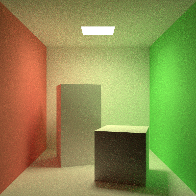
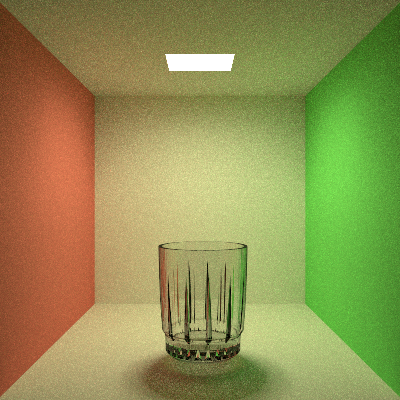
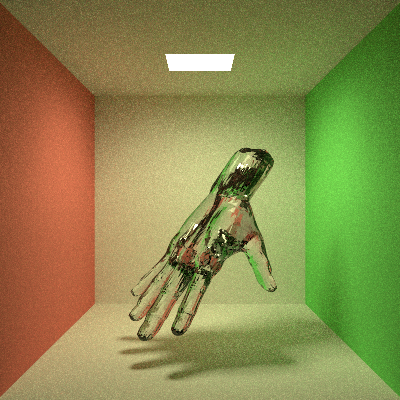
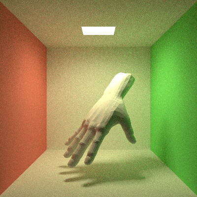
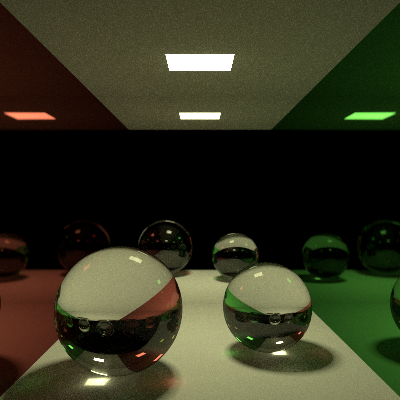

# fragment-shader-path-tracer

This is an implementation of a path tracer by using the OpenGL fragment shader. It uses one big shader for everything, which can be less efficient in this case because of the higher divergence rates between different GPU SIMD lanes. The reason for this approach is that it provides massive simulation speed improvement, compared to the CPU, at almost no cost in complexity of implementation (appart from some shader specific things like shader uniforms and OpenGL setup code, the shader code is basically the same as it would be on the CPU side). This allows faster testing, debugging and experimentation with path tracing concepts, compared to CPU implementation.

Path tracer handles diffuse, specular and dielectric surfaces. Dielectric surfaces need to be closed and they can't be nested inside each other. This is because the tracer doesn't use any kind of stack to keep track of nested layers. If that is needed, the algorithm can be easily adapted. The main light is hardcoded and only that light is sampled on every bounce of the ray to improve convergence rates. If there are other lights in the scene, they will only be sampled if the ray hits them directly. Light importance sampling is not yet implemented and will not be as long as the main light is hardcoded.

Path tracer supports spheres and triangles as basic objects. For scenes that only use triangles, it is possible to generate and use the BVH. BVH currently doesn't support spheres and the only reason for this is that the scenes with the large number of spheres were not used as examples or during testing. BVH is constructed using [Parallel Locally-Ordered Clustering](https://meistdan.github.io/publications/ploc/paper.pdf) implemented on the CPU instead of the GPU, like the original paper suggests. The BVH, which is represented as a tree during construction, is linearized and tightly packet before being sent to the shader.

Shader defines constraints for maximum number of spheres, materials, triangles, BVH nodes and the size of the BVH traversal stack. If the program requires larger bounds for these constrains then they should be changed in the shader prior to use.

During rendering, the results are by default shown in the non-interactable window where the new data is presented after rendering of each batch. One batch represents the amount of path tracing bounces times the number of pixels. If the window has dimension N x M, and the batch jump count is defined as P, then one batch is completed if the calculation is completed for N x M pixels and at max P ray bounces for each of those pixels. Each batch result is then saved into the uniform buffer and is used as a starting point for another batch. The batch jump count must divide the ray jump count (total number of jumps that one ray can potentially make while spreading through the scene).

The window itself, even though it is created by default, is not needed. The only thing that is needed is the OpenGL context, so it is possible to comment out the window creation code and instead just write the OS specific OpenGL context setup routine. Window does not present any timing information nor the rendering state. These are sent to the standard output (real-time completion updates use ANSI escape codes, so the terminal with that support is needed).

Scenes used for rendering below examples are part of the code and are provided by static methods.

Building is done by using provided build.bat file on Windows. For Linux distributions or some other OS, separate script needs to be written, but it requires minimal effort, and the needed dependencies are described below.

## Dependencies

OpenGL version 3.1 or higher is needed because the setup code uses Core OpenGL profile and shader requires Uniform Buffers. You need to link against OpenGL library provided by your OS (the one that contains the implementation for earliest OpenGL versions, like 1.0 or 1.1, and that provides the function that can be used to retrieve the function pointers from the OpenGL driver). On Windows, this is opengl32.lib, on Linux it is libGL.so.

GLFW dynamic library is needed for window setup, which is used by default. If the window creation is commented out or removed, then the user must write the OpenGL context setup routines, and in that case, there is no need to use GLFW. The repository contains the GLFW dynamic library compiled on Windows using MSVC and Multithreaded version of the C++ runtime library. If different version is needed, then it needs to be provided.

Depending on the OS, you might need to link against some OS specific libraries. For example, on Windows, gdi32.lib, user32.lib and shell32.lib are needed. Finding out which ones are needed on the specific OS is easily done by compiling and linking the program and then going through all the missing symbols.

## Images

